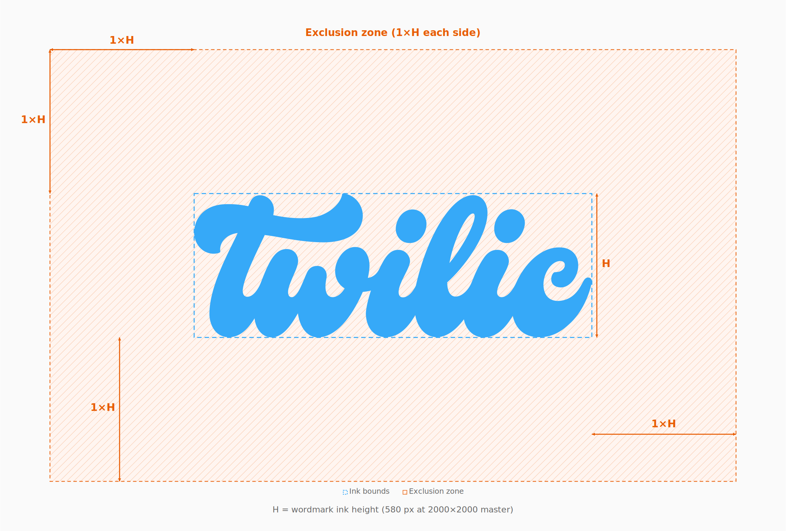
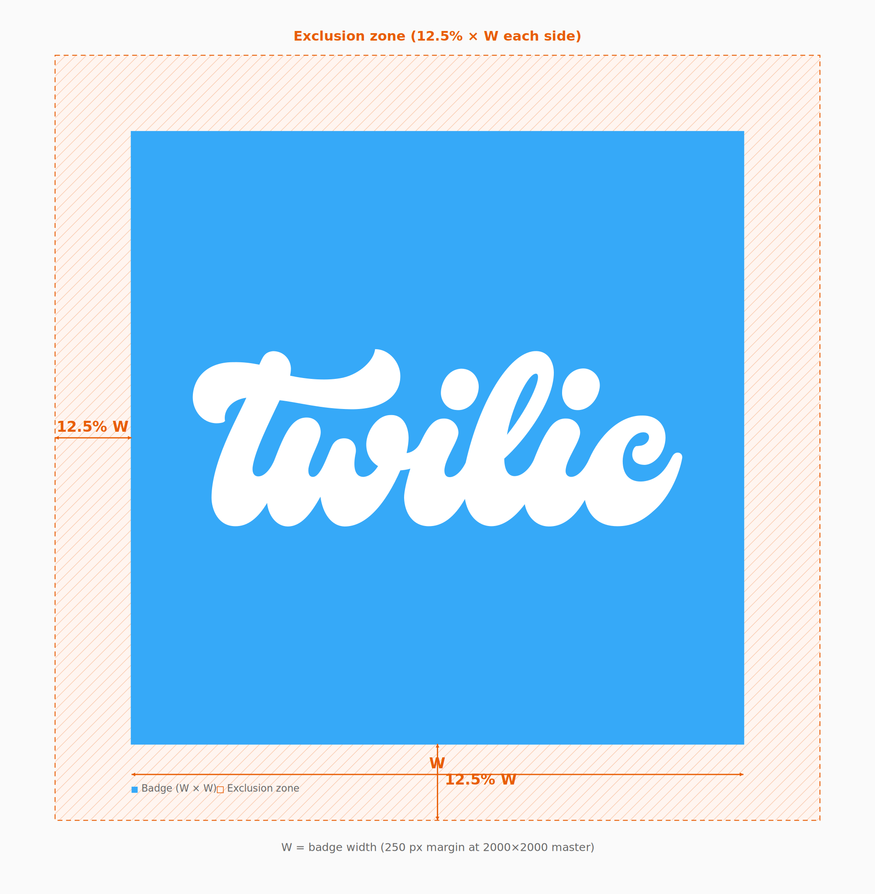

# Twilic Brand Guidelines

These rules apply to all uses of the Twilic name and logo. When in doubt, use the approved SVG files in [`logo/`](logo/) without alteration.

## Logo variants

### Badge (square)

The badge is a 1∶1 lockup: brand blue field with a white handwritten wordmark, or the inverted pairing.

| Variant | File | Background | Wordmark |
| --- | --- | --- | --- |
| Normal | [`logo/badge/normal.svg`](logo/badge/normal.svg) | `#36A9F8` | `#FFFFFF` |
| Inverted | [`logo/badge/inverted.svg`](logo/badge/inverted.svg) | `#FFFFFF` | `#36A9F8` |

**Use the badge** for profile images, favicons, app icons, and any context that expects a square asset.

### Wordmark (text only)

The wordmark is the handwritten “twilic” letterforms without the square background. The canvas is still square for consistent scaling; transparent areas are not part of the mark.

| Variant | File | Wordmark color | Background |
| --- | --- | --- | --- |
| Normal | [`logo/wordmark/normal.svg`](logo/wordmark/normal.svg) | `#36A9F8` | Transparent |
| Inverted | [`logo/wordmark/inverted.svg`](logo/wordmark/inverted.svg) | `#FFFFFF` | Transparent |

**Use the wordmark** for documentation headers, slide titles, and horizontal layouts where a square badge would feel heavy.

**Do not** place the blue wordmark on the brand blue (`#36A9F8`) or similar hues without enough contrast. Use the inverted wordmark on dark backgrounds instead.

## Color

### Primary palette

| Name | Hex | RGB | Role |
| --- | --- | --- | --- |
| Twilic Blue | `#36A9F8` | 54, 169, 248 | Primary brand color, badge background, wordmark on light surfaces |
| White | `#FFFFFF` | 255, 255, 255 | Wordmark on blue badge, inverted badge background |

Only these two colors appear in the official color assets. Do not substitute similar blues or off-whites.

### Contrast

- **Badge (normal):** white on `#36A9F8` — suitable for UI and print at typical sizes.
- **Wordmark (normal) on white or light gray (≥ `#F0F0F0`):** meets common contrast expectations for brand marks.
- **Wordmark (inverted) on dark gray (≤ `#333333`) or black:** preferred for dark mode and photography overlays.

If the background is busy (photo, gradient, pattern), add a solid backing plate (white or dark gray at 90% opacity minimum) behind the wordmark, then apply clear space.

## Grayscale and monochrome

Color is preferred. When color printing or single-ink reproduction is required, use **approved neutrals** — not automatic “Convert to Grayscale” filters that shift hue.

### Badge (grayscale)

| Role       | Hex       | Notes            |
| ---------- | --------- | ---------------- |
| Background | `#D9D9D9` | Light gray field |
| Wordmark   | `#4A4A4A` | Dark gray ink    |

Do not use the color badge with a grayscale filter applied in design tools; rebuild from the values above or request a dedicated asset.

### Wordmark (grayscale)

| Background                   | Wordmark  |
| ---------------------------- | --------- |
| White or light (≥ `#F0F0F0`) | `#2B2B2B` |
| Dark (≤ `#333333`)           | `#F5F5F5` |

### Rules

- **Do not** tint the logo (drop shadows, gradients, duotone, brand-color overlays).
- **Do not** reduce opacity below 100% on the mark itself (background plates may use opacity).
- **Do not** use low-contrast gray pairings (e.g. `#999` on `#BBB`).
- **Single-color print:** use black (`#000000`) wordmark on white, or reverse (white on black) for inverted layouts.

## Clear space (exclusion zone)

Nothing else (text, icons, borders, edges of crops) may enter the clear space around the logo.

### Unit of measure: **H**

**H** = the height of the wordmark ink bounds (the handwritten letterforms only, not the full square canvas).

On the master 2000×2000 assets, **H ≈ 580 px** (wordmark ink height ≈ 29% of canvas height).

_Source: [`diagrams/clear-space-unit-h.svg`](diagrams/clear-space-unit-h.svg) — orange hatch = exclusion zone; dashed blue = ink bounds; **H** = ink height._

Apply **1× H** padding on all four sides of the ink bounds, measured from the outermost stroke of the letterforms.

### Badge-specific

For the **square badge**, also keep **at least 12.5% of the badge width** between the badge edge and any neighboring content when the badge is used as a whole unit (e.g. app icon in a grid). On the 2000 px master, that is **250 px** minimum.

_Source: [`diagrams/clear-space-badge.svg`](diagrams/clear-space-badge.svg) — orange hatch = exclusion zone; **W** = badge width._

When both badge edge and wordmark matter, use the **larger** of (1× H from wordmark) or (12.5% of badge width).

### Wordmark-only

The SVG includes built-in margin around the ink (≈ 200 px left/right, ≈ 710 px top/bottom on the 2000 px canvas). That margin is **not** extra clear space you may remove by cropping.

When placing the wordmark file:

1. Measure H from the visible letterforms after scaling.
2. Add **1× H** beyond the ink on all sides before other content.

## Minimum size

| Medium      | Badge (width) | Wordmark (ink height H) |
| ----------- | ------------- | ----------------------- |
| Screen / UI | 32 px         | 16 px                   |
| Print       | 10 mm         | 5 mm                    |

Below these sizes, strokes merge and legibility suffers. Prefer the badge only at small sizes; avoid wordmark-only below 24 px ink height.

## Scaling and file handling

- **Do** scale proportionally (lock aspect ratio).
- **Do** export from SVG for raster needs.
- **Do not** stretch, squeeze, rotate, skew, or outline the paths.
- **Do not** recreate the wordmark in another typeface or hand-drawn style.
- **Do not** add effects (glow, bevel, emboss, 3D, animation that distorts the paths).
- **Do not** rearrange, abbreviate, or pair with other logotypes in a single lockup without approval.

## Backgrounds

| Background | Recommended asset |
| --- | --- |
| White, light gray, light UI | Badge normal, or wordmark normal |
| Brand blue `#36A9F8` | Badge normal only (white wordmark) — do not use blue wordmark on blue |
| Dark gray, black, dark UI | Badge inverted, or wordmark inverted |
| Photography / busy | Wordmark inverted or normal on a solid plate + clear space |
| Print, grayscale | See [Grayscale and monochrome](#grayscale-and-monochrome) |

## Misuse (do not)

- Change hex values or apply gradients to the mark.
- Place normal blue wordmark on blue or low-contrast backgrounds.
- Crop through letterforms or clear space.
- Use outdated or unofficial artwork.
- Use the logo to imply endorsement without permission.

## Asset dimensions

All SVGs share `viewBox="0 0 2000 2000"` for interchangeable sizing in templates.

| Asset    | Ink bounds (approx., 2000 px master)         |
| -------- | -------------------------------------------- |
| Wordmark | 1600 × 580 px, centered horizontally         |
| Badge    | Same wordmark placement on full-bleed square |

## Updates

PNG exports at **2000×2000 px** ship alongside each logo SVG in [`logo/`](logo/). Regenerate them with `pnpm export:png` after SVG changes. The SVG files remain the source of truth.

## License

- **Logo files** in [`logo/`](logo/) — use only as described in this document; see [`LICENSE`](LICENSE) (logo and trademark terms).
- **This guide and diagrams** — [CC BY 4.0](https://creativecommons.org/licenses/by/4.0/); see [`LICENSE-CC-BY-4.0.txt`](LICENSE-CC-BY-4.0.txt).
